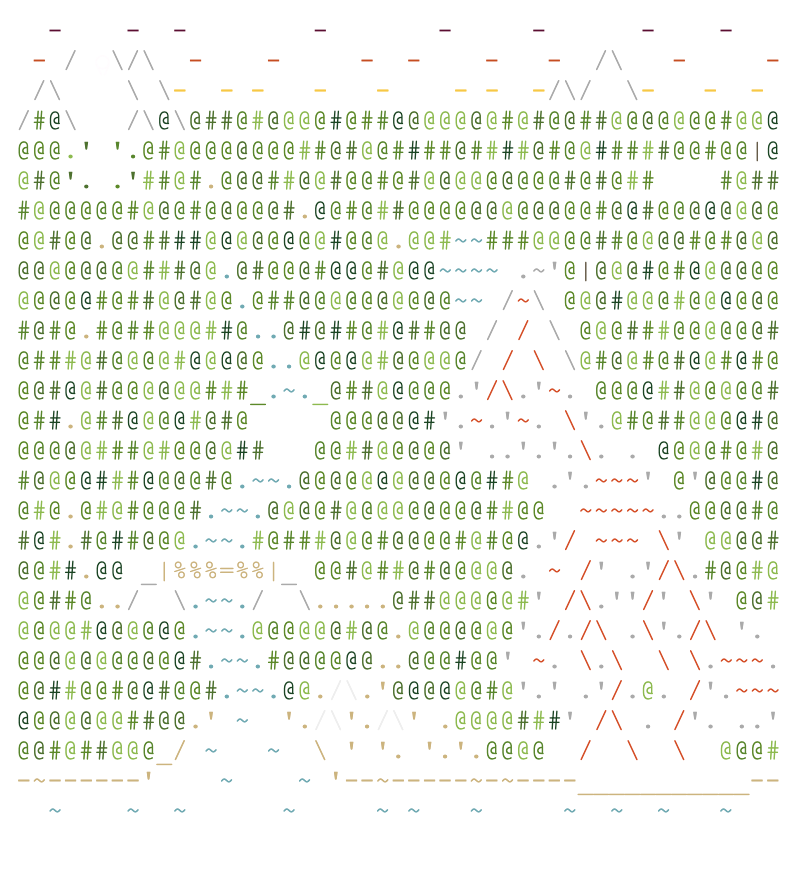
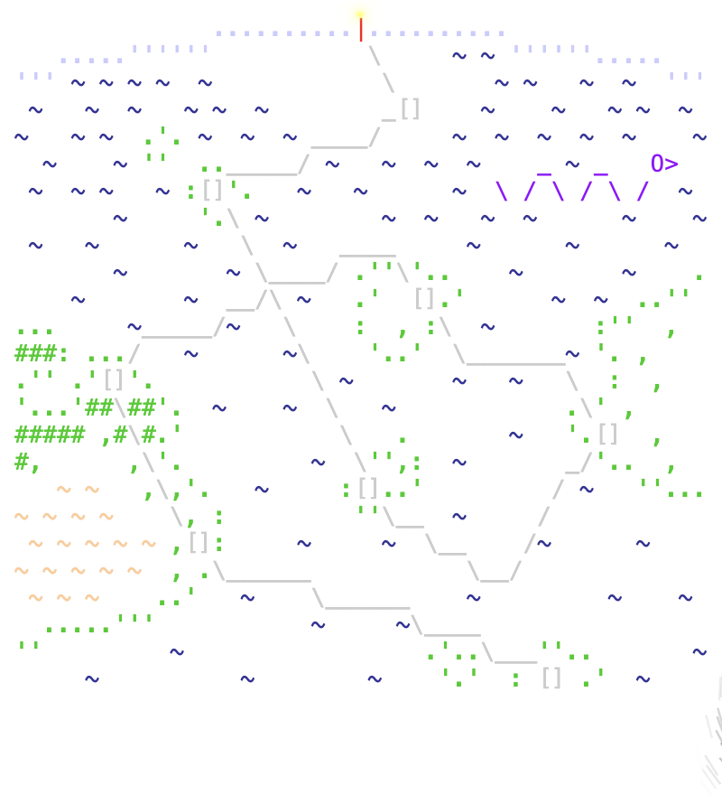
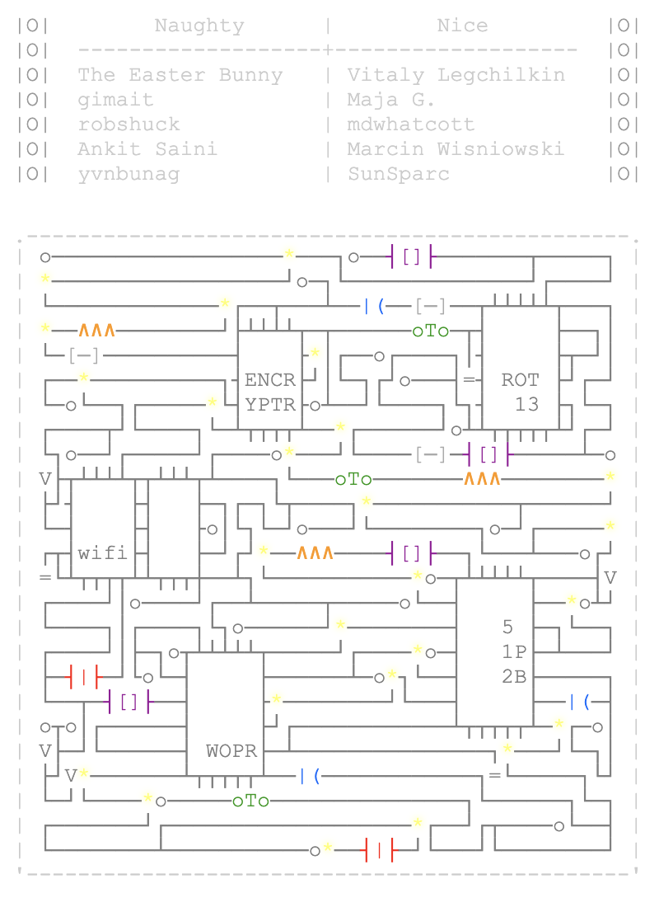

# Advent of Code
My https://adventofcode.com/ solutions

## [2022](resources/2022)

## [2021](resources/2021)

## [2020](resources/2020)

## [2019](resources/2019)

## [2018](resources/2018)

## [2017](resources/2017)

## [2016](resources/2016) 

## [2015](resources/2015) 

## Solutions

[2015](aoc/year_2015) 
[2016](aoc/year_2016) 
[2017](aoc/year_2017)
[2018](aoc/year_2018)
[2019](aoc/year_2019)
[2020](aoc/year_2020)
[2021](aoc/year_2021)
[2022](aoc/year_2022)
