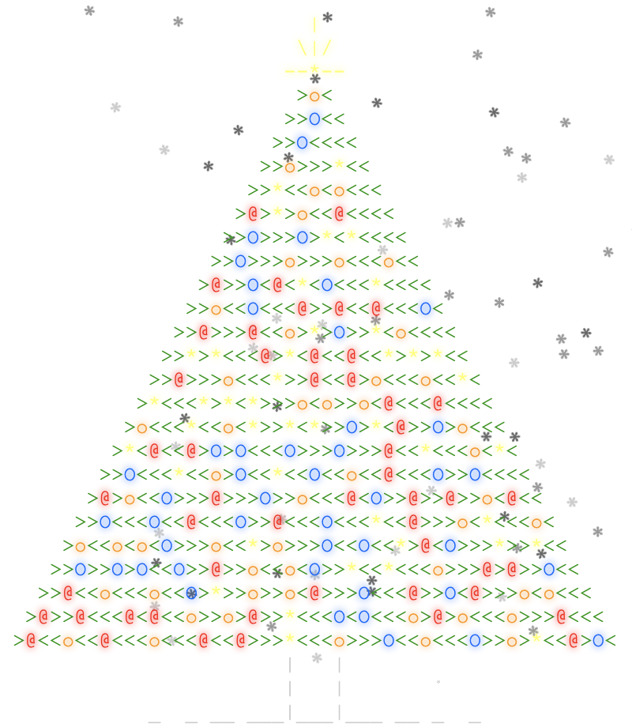

<pre>
&nbsp;
<a href='day/24'>Day 24: It Hangs in the Balance</a>
<a href='day/23'>Day 23: Opening the Turing Lock</a>
<a href='day/22'>Day 22: Wizard Simulator 20XX</a>
<a href='day/21'>Day 21: RPG Simulator 20XX</a>
<a href='day/20'>Day 20: Infinite Elves and Infinite Houses</a>
<a href='day/19'>Day 19: Medicine for Rudolph</a>
<a href='day/18'>Day 18: Like a GIF For Your Yard</a>
<a href='day/17'>Day 17: No Such Thing as Too Much</a>
<a href='day/16'>Day 16: Aunt Sue</a>
<a href='day/15'>Day 15: Science for Hungry People</a>
<a href='day/14'>Day 14: Reindeer Olympics</a>
<a href='day/13'>Day 13: Knights of the Dinner Table</a>
<a href='day/12'>Day 12: JSAbacusFramework.io</a>
<a href='day/11'>Day 11: Corporate Policy</a>
<a href='day/10'>Day 10: Elves Look, Elves Say</a>
<a href='day/9'>Day 9: All in a Single Night</a>
<a href='day/8'>Day 8: Matchsticks</a>
<a href='day/7'>Day 7: Some Assembly Required</a>
<a href='day/6'>Day 6: Probably a Fire Hazard</a>
<a href='day/5'>Day 5: Doesn't He Have Intern-Elves For This?</a>
<a href='day/4'>Day 4: The Ideal Stocking Stuffer</a>
<a href='day/3'>Day 3: Perfectly Spherical Houses in a Vacuum</a>
<a href='day/2'>Day 2: I Was Told There Would Be No Math</a>
<a href='day/1'>Day 1: Not Quite Lisp</a>
&nbsp;
&nbsp;
&nbsp;
</pre>
