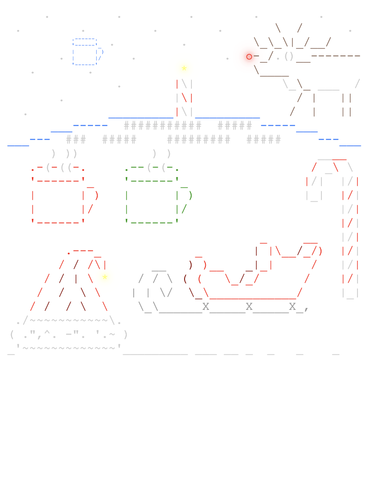

<pre>
&nbsp;
&nbsp;
&nbsp;
&nbsp;
&nbsp;
&nbsp;
&nbsp;
&nbsp;
&nbsp;
&nbsp;
&nbsp;
&nbsp;
&nbsp;
&nbsp;
&nbsp;
&nbsp;
&nbsp;
&nbsp;
&nbsp;
&nbsp;
<a href='day/4'>Day 4: Repose Record</a>
<a href='day/3'>Day 3: No Matter How You Slice It</a>
<a href='day/2'>Day 2: Inventory Management System</a>
<a href='day/1'>Day 1: Chronal Calibration</a>
</pre>
