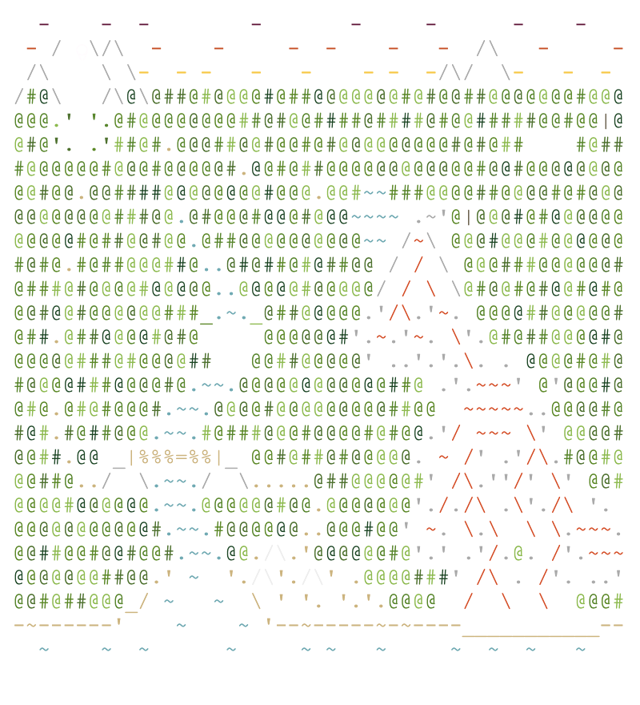

\
[Day 25: Full of Hot Air](day/25)\
[Day 24: Blizzard Basin](day/24)\
[Day 23: Unstable Diffusion](day/23)\
[Day 22: Monkey Map](day/22)\
[Day 21: Monkey Math](day/21)\
[Day 20: Grove Positioning System](day/20)\
[Day 19: Not Enough Minerals](day/19)\
[Day 18: Boiling Boulders](day/18)\
[Day 17: Pyroclastic Flow](day/17)\
[Day 16: Proboscidea Volcanium](day/16)\
[Day 15: Beacon Exclusion Zone](day/15)\
[Day 14: Regolith Reservoir](day/14)\
[Day 13: Distress Signal](day/13)\
[Day 12: Hill Climbing Algorithm](day/12)\
[Day 11: Monkey in the Middle](day/11)\
[Day 10: Cathode-Ray Tube](day/10)\
[Day 9: Rope Bridge](day/9)\
[Day 8: Treetop Tree House](day/8)\
[Day 7: No Space Left On Device](day/7)\
[Day 6: Tuning Trouble](day/6)\
[Day 5: Supply Stacks](day/5)\
[Day 4: Camp Cleanup](day/4)\
[Day 3: Rucksack Reorganization](day/3)\
[Day 2: Rock Paper Scissors](day/2)\
[Day 1: Calorie Counting](day/1)
