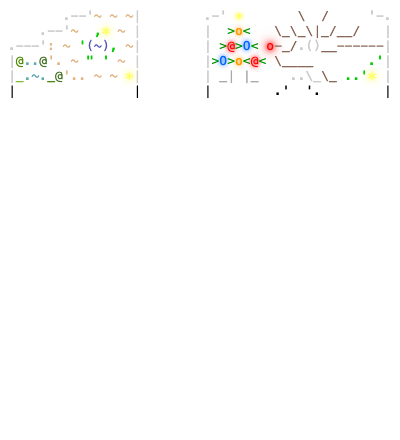

<pre>
<a href='day/1'>Day 1: Historian Hysteria</a>
<a href='day/2'>Day 2: Red-Nosed Reports</a>
<a href='day/3'>Day 3: Mull It Over</a>
<a href='day/4'>Day 4: Ceres Search</a>
<a href='day/5'>Day 5: Print Queue</a>
<a href='day/6'>Day 6: Guard Gallivant</a>
<a href='day/7'>Day 7: Bridge Repair</a>
<a href='day/8'>Day 8: Resonant Collinearity</a>
<a href='day/9'>Day 9: Disk Fragmenter</a>
<a href='day/10'>Day 10: Hoof It</a>
<a href='day/11'>Day 11: Plutonian Pebbles</a>
<a href='day/12'>Day 12: Garden Groups</a>
<a href='day/13'>Day 13: Claw Contraption</a>
<a href='day/14'>Day 14: Restroom Redoubt</a>
<a href='day/15'>Day 15: Warehouse Woes</a>
<a href='day/16'>Day 16: Reindeer Maze</a>
<a href='day/17'>Day 17: Chronospatial Computer</a>
<a href='day/18'>Day 18: RAM Run</a>
<a href='day/19'>Day 19: Linen Layout</a>
<a href='day/20'>Day 20: Race Condition</a>
<a href='day/21'>Day 21: Keypad Conundrum</a>
<a href='day/22'>Day 22: Monkey Market</a>
<a href='day/23'>Day 23: LAN Party</a>
<a href='day/24'>Day 24: Crossed Wires</a>
&nbsp;
</pre>
